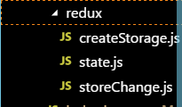
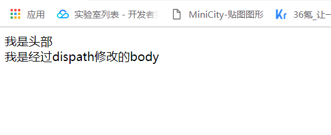

# do-redux
撸一个redux
#### 导语
一开看redux的时候还是比较蒙的，感觉比较绕，但是又好像是那么回事，接触一个新概念的时候可能都是如此，多去接触就熟悉了，今天就来分享下redux的三大核心为什么就能如此神奇的施展魔法，干撸完源码，真的就有种拨开云雾见日出的感觉

#### 开整
我们再来稍微温习下redux的工作原理。垫吧垫吧，要不然容易晕。redux是为了实现数据共享，那么任何一个组件都会得到所有的状态，而且组件也不可能只用自己的状态，如果组件只用自己自己的状态，那么就不需要redux了，一切就如此简单明了。store作为一个状态树，来对状态进行管理。通过它的getState可以对state进行读操作，action发布命令对状态进行写（类似于产品提需求）。这是所有组件都要遵守的约定，因为redux让所有状态都共享，所以说，读可以让你读，不严格要求，但是写操作，只能通过action修改state(执行相应的reducer)，这样才能保证数据的安全性。而对于组件来说，你只要dispatch一个action就好了。就是如此方便。好了，逻辑都明白了，接下来分析下内部机制就有基础了。

#### 一探store
##### 分清state
一般我们的redux都是配合react使用，但是react和redux只是合作关系，并没有血缘关系。因此，自然react中的state也和redux中的state不是一回事了，react中的state是组件内部自己的状态信息，而redux中的state是redux自己的数据。React配合redux使用的时候，react就会拿redux里面的state。既然如此我们在新建一个redux，在redux下目录结构如下：
  
首先我们把要共享的数据放在state里面
~~~
 export const state = {
    head: {
        text: "我是头部",
        color: 'red'
    },
    body: {
        text: "我是body",
        color: "green"
    }
}
~~~
这样我们就把要共享的数据设置好了，待会我们只要把这个文件暴露的接口引入就能使用这里面的数据了。  
##### 构建createStoreAPI
我们为了把我们刚才构建的state也放到待会我们要用构建的这个createStoreAPI创建的的对象里面去，我们需要这个函数接受两个参数，一个就是我们创建的最初数据状态，另一个是修改函数。于是我们的createStorage.js代码如下：
~~~
export const createStore = (state,storeChange) => {
    const store = state || {};
    const dispatch = (action) => {
        storeChange(store,action);
    }
    return { store,dispatch }
}
~~~
这段代码的设计思想是，当我们在创建一个store对象时，我们可以把后台提供的原始数据放入到store这个对象中，然后再暴露一个dispatch方法来修改state。按照规则，要修改共享的状态，必须通过dispath方法，然后接收一个action，他会调用reducer函数来真正执行改变。这样的就相当于通过store把action和reducer连接起来了。一个差不多的createStoreAPI就创建完了
##### 构建storeChangeAPI
在createStorage里面，我们已经把组件修改state，交给了dispatch(action) ,当我们组件使用修改方法的的时候，就可以dispatch了，那这样就更加明朗了。毫无疑问，我们的storeChange肯定就是一个reducer函数了，于是storeChange.js代码如下：
~~~
export const storeChange = (state,action) => {
    switch(action.type) {
        case 'HEAD_COLOR':
             state.head.color = action.color
        break;
        case 'BODY_TEXT':
            state.body.text = action.text
        break;
        default: 
            return state;
    }
}
~~~
工欲善其事，必先利其器。现在要用的武器都打造好了，自然就哟使用起来了，在index.js下代码如下
~~~
import { state } from './redux/state.js'
import { storeChange } from './redux/storeChange'
import { createStore } from './redux/createStorage'

const { store ,dispatch } =createStore(state, storeChange)

function renderHead (state) {
    const head = document.getElementById('head');
    head.innerText = state.text;
    head.color = state.color;

}
function renderBody(state) {
    const head = document.getElementById('body');
    head.innerText = state.text;
    head.color = state.color;

}
function renderApp(state) {
    renderHead(state.head)
    renderBody(state.body)
}
renderApp(store)
dispatch({type: 'BODY_TEXY',text: '我是经过dispath修改的body'})
renderApp(store)
~~~
创建rederAPP函数分别渲染head和body
当我们需要改变state的时候就dispatch一下action，当我们修改完了，要页面重新渲染下，页面就发生了改变了。这就是一个简易的redux了
这就是最终的效果：  

#### 结束语
本来想在本文继续把context这个大佬请出来的，但是感觉篇幅会很长，而且刚好时间也比较尴尬，所以今天的分享就先到这，context下次分享了。自己并没有很牛逼，所以分享的东西可能会比较基础一些，但是我个人感觉挺通俗易懂的。但是编程路上，且行且珍惜，我会慢慢提高我的文章质量，分享更多心得。觉得不错的朋友可以支持一波，谢谢大家。
